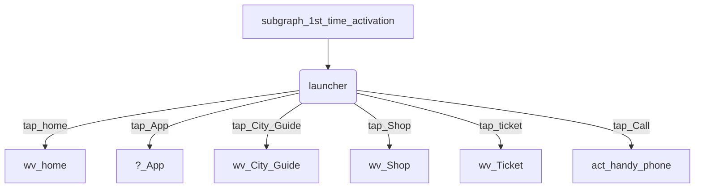
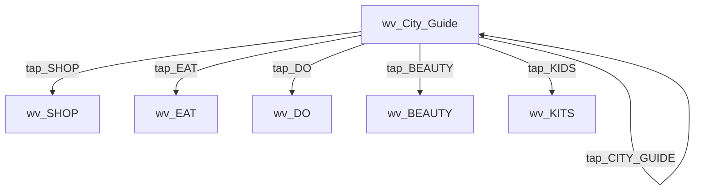
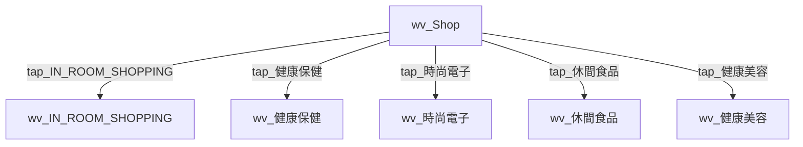
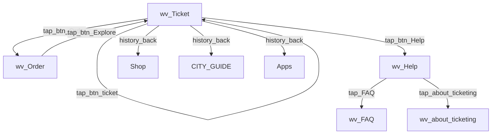
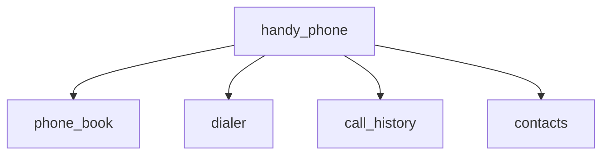

# feature/features.main.activity.LauncherActivity flowchart

#### flow of activation



- subgraph 1st time activation

```mermaid
graph TB
subgraph 1st_time_activation
  tstart(tutorial_start_here)
    --> t1[Tap_this_show_the_hostel_details]
  t1 -- tap --> t2[Tap_on_this_icon_to_open_the_side_bar]
  t2 -- tap --> t3[Scroll_down_to_explore_all_the_main_features_of_handy]
  t3 -- tap --> t4(Shop_for_discounted_souvenirs)
  t4 -- tap --> t5(Tours_and_tickets_to_major_attractions)
  t5 -- tap --> tTicket(wv_Tickets)
  tTicket -- tap back on wv_Tickets --> wv_launcher_lobby(launcher_lobby)
  wv_launcher_lobby-->tdone(tutorial_done)
end
```

- subgraph City_Guide


- subgraph shop



- subgraph ticketing



- subgraph handy_phone


#### steps to be filled

```sequence
1 -> 2: hehe
2 -> 1: haha
```
